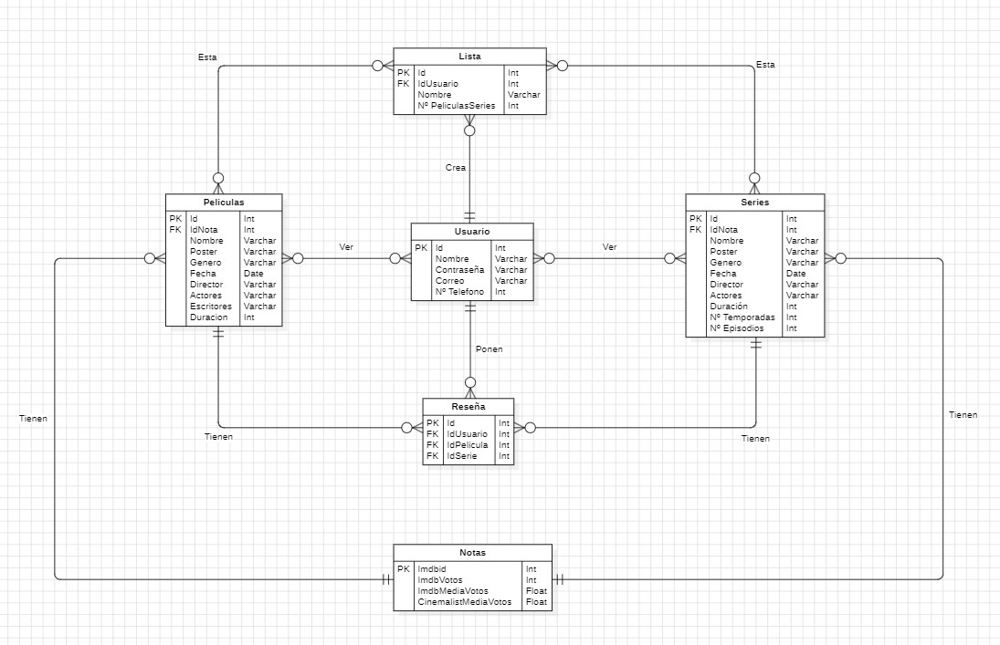

# Cinemalist
Aplicación para ver la información de peliculas y series, se podran marcar si se han visto o si se quieren ver en el futuro, mediante la creación de una "wachlist" o listas.
## Modelo de datos

## Captura de figma

## Captura de ejemplos de datos
